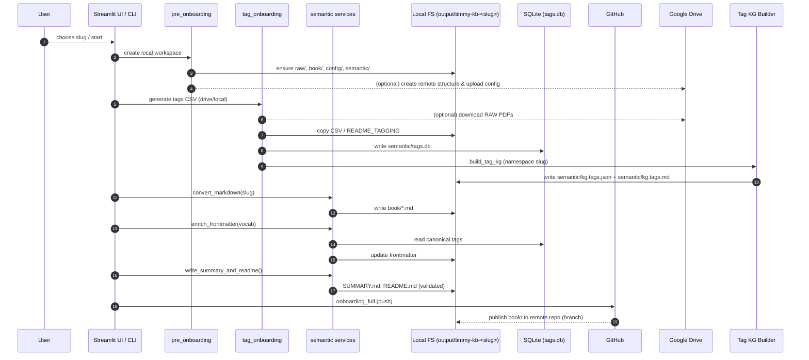

# Architecture Overview (v1.0 Beta)

This page contains two Mermaid diagrams that illustrate Timmy KB at a high level.

## Components

```mermaid
flowchart LR
    subgraph Client
      UI[Streamlit UI (src/ui/*)]
      CLI[CLI Orchestrators]
    end

    subgraph Orchestrators
      PRE[pre_onboarding.py]
      TAG[tag_onboarding.py]
      KG[kg_build.py (Tag KG Builder)]
      SEMCLI[semantic_onboarding.py (wrapper dei service semantic.*)]
      FULL[onboarding_full.py]
      VISIONCLI[tools/gen_vision_yaml.py]
    end

    subgraph Pipeline
      PCTX[pipeline.context]
      PPATH[pipeline.path_utils]
      PCONT[pipeline.content_utils]
      PLOG[pipeline.logging_utils]
      PGIT[pipeline.github_utils]
      PDRIVE[pipeline.drive_utils]
    end

    subgraph Semantic
      SEMANTIC[semantic.convert/frontmatter/embedding/mapping + semantic.nlp_runner]
      SVISION[semantic.vision_provision + UI services]
    end

    subgraph Storage
      DB[(SQLite: semantic/tags.db)]
      FILES[[output/timmy-kb-<slug>]]
    end

    subgraph Adapters
      HONKIT[Preview (HonKit/Docker)]
      GITHUB[GitHub (push)]
      DRIVE[Google Drive]
    end

    subgraph AI Services
      OPENAI[(OpenAI Chat API)]
    end

    UI -->|actions| PRE
    UI -->|actions| TAG
    UI -->|actions| KG
    UI -->|actions| SEMCLI
    UI -->|preview| HONKIT

    CLI --> PRE
    CLI --> TAG
    CLI --> KG
    CLI --> SEMCLI
    CLI --> FULL
    CLI --> VISIONCLI

    PRE --> PCTX
    PRE --> PDRIVE
    PRE --> FILES

    TAG --> KG
    KG --> SEMANTIC
    TAG --> FILES
    TAG --> DB

    SEMCLI --> SEMANTIC
    SEMANTIC --> PCONT
    VISIONCLI --> SVISION
    SEMANTIC --> FILES
    SEMANTIC --> DB

    FULL --> PGIT
    PGIT --> GITHUB

    SVISION --> OPENAI

- **Tag KG Builder:** `kg_build.py` (CLI) e il pannello UI Knowledge Graph dei tag invocano `build_kg_for_workspace`, leggono `semantic/tags_raw.json` e scrivono `semantic/kg.tags.json`/`semantic/kg.tags.md` prima che `semantic_onboarding` rigeneri i README.

    PDRIVE --> DRIVE
```

## End-to-end Sequence



## Workspace SSoT & Path Flow

The onboarding pipeline (CLI, UI, semantic stages) now relies on a unified WorkspaceLayout as the Single Source of Truth (SSoT) for all workspace-related filesystem paths. Paths such as raw/, semantic/, book/, logs/, config/, and mapping/ are no longer constructed manually. They are instead resolved through WorkspaceLayout, which enforces path-safety, consistency across orchestrators, and eliminates drift between CLI and UI components.

`
                     ┌────────────────────────────┐
                     │       ClientContext        │
                     │  (slug, settings, env)     │
                     └─────────────┬──────────────┘
                                   │
                                   ▼
                     ┌────────────────────────────┐
                     │      WorkspaceLayout       │
                     │  SSoT dei path derivati    │
                     │  raw/ semantic/ book/      │
                     │  logs/ config/ mapping     │
                     └─────────────┬──────────────┘
                                   │
     ┌─────────────────────────────┼───────────────────────────────┐
     ▼                             ▼                               ▼
┌──────────────────┐ ┌────────────────────┐ ┌──────────────────────┐
│ CLI Orchestrators │ │ Streamlit UI / Services │ │ Semantic Pipeline │
│ pre, tag, semantic, │ │ new_client, tagging, │ │ convert, enrich, readme│
│ kg_build, full │ │ builder, semantics UI │ │ indexing, mapping │
└─────────┬──────────┘ └──────────┬──────────────┘ └─────────────┬──────────┘
│ │ │
▼ ▼ ▼
Uses always:       Uses always:            Uses always:
WorkspaceLayout.*  WorkspaceLayout.*       WorkspaceLayout.*
log_file, raw_dir,  base_dir, raw_dir,      semantic_dir, book_dir,
semantic_dir …     semantic_dir …          mapping_path, tags_db
`

Manual construction of workspace paths (e.g. base_dir/'raw', base_dir/'semantic') is deprecated. All components must rely on WorkspaceLayout or ClientContext helpers to ensure filesystem consistency and security guarantees. Refer to the Coding Rules and Developer Guide for the enforced workflow and examples.

Note operative

- YAML e usato per il bootstrap iniziale; a runtime la fonte di verita e SQLite (semantic/tags.db).
- Le fasi convert/enrich/summary condividono l'orchestratore `_run_build_workflow` e loggano `semantic.book.frontmatter` con il numero di file arricchiti (UI/CLI allineate).
- La conversione fallisce se dopo il run esistono solo README/SUMMARY (nessun contenuto .md generato): assicurarsi che `raw/` contenga PDF validi.
- La generazione del mapping Vision usa `semantic/vision_provision.py` (con interfaccia UI in `ui/services/vision_provision.py`): salva uno snapshot testuale (`semantic/vision_statement.txt`) accanto allo YAML e chiama sempre il modello definito in `config/config.yaml`, letto via `get_vision_model()`.
- Entry point CLI aggiuntivi (`ingest.py`, `retriever.py`, `semantic_headless.py`, `kb_db.py`) orchestrano step stand-alone riusando gli helper di pipeline e semantic.
- Lo stato di tagging e di UI condiviso vive in `storage/tags_store.py` (JSON atomico) e `clients_db/ui_state.json`; restano nel perimetro `output/timmy-kb-<slug>` come SSoT locale.
- L'indicizzazione su SQLite esclude `README.md` e `SUMMARY.md` e scarta eventuali embedding vuoti per singolo file (log "Embedding vuoti scartati").
- Indicizzazione parziale: su mismatch tra `contents` ed `embeddings` si indicizza sul minimo comune; vengono emessi `semantic.index.mismatched_embeddings`, `semantic.index.embedding_pruned` e un solo `semantic.index.skips` con chiavi `{skipped_io, skipped_no_text, vectors_empty}`.
- Telemetria run vuoti: i rami "no files"/"no contents" entrano in `phase_scope` con `artifact_count=0` e chiudono con `semantic.index.done`.
