# Architecture Overview

This page contains two Mermaid diagrams that illustrate Timmy KB at a high level.

## Components

```mermaid
flowchart LR
    subgraph Client
      UI[Streamlit UI (src/ui/*)]
      CLI[CLI Orchestrators]
    end

    subgraph Orchestrators
      PRE[pre_onboarding.py]
      TAG[tag_onboarding.py]
      SEMCLI[semantic_onboarding.py (wrapper di semantic.api)]
      FULL[onboarding_full.py]
      VISIONCLI[gen_vision_yaml.py]
    end

    subgraph Pipeline
      PCTX[pipeline.context]
      PPATH[pipeline.path_utils]
      PCONT[pipeline.content_utils]
      PLOG[pipeline.logging_utils]
      PGIT[pipeline.github_utils]
      PDRIVE[pipeline.drive_utils]
    end

    subgraph Semantic
      SEMANTIC[semantic.api + semantic.tags_io + semantic.semantic_mapping]
      SVISION[semantic.vision_*]
    end

    subgraph Storage
      DB[(SQLite: semantic/tags.db\nsemantic/finance.db)]
      FILES[[output/timmy-kb-<slug>]]
    end

    subgraph Adapters
      HONKIT[Preview (HonKit/Docker)]
      GITHUB[GitHub (push)]
      DRIVE[Google Drive]
    end

    subgraph AI Services
      OPENAI[(OpenAI Chat API)]
    end

    UI -->|actions| PRE
    UI -->|actions| TAG
    UI -->|actions| SEMCLI
    UI -->|preview| HONKIT

    CLI --> PRE
    CLI --> TAG
    CLI --> SEMCLI
    CLI --> VISIONCLI
    CLI --> FULL

    PRE --> PCTX
    PRE --> PDRIVE
    PRE --> FILES

    TAG --> SEMANTIC
    TAG --> FILES
    TAG --> DB

    SEMCLI --> SEMANTIC
    VISIONCLI --> SVISION
    SEMANTIC --> PCONT
    SVISION --> FILES
    SEMANTIC --> FILES
    SEMANTIC --> DB

    FULL --> PGIT
    PGIT --> GITHUB

    SVISION --> OPENAI

    PDRIVE --> DRIVE
```

## End-to-end Sequence

```mermaid
sequenceDiagram
    autonumber
    participant User
    participant UI as Streamlit UI / CLI
    participant PRE as pre_onboarding
    participant TAG as tag_onboarding
    participant SEM as semantic.api
    participant FS as Local FS (output/…)
    participant DB as SQLite (tags.db)
    participant GH as GitHub
    participant DRV as Google Drive

    User->>UI: choose slug / start
    UI->>PRE: create local workspace
    PRE->>FS: ensure raw/, book/, config/, semantic/
    PRE-->>DRV: (optional) create remote structure & upload config

    UI->>TAG: generate tags CSV (drive/local)
    TAG-->>DRV: (optional) download RAW PDFs
    TAG->>FS: copy CSV / README_TAGGING
    TAG->>DB: write semantic/tags.db

    UI->>SEM: convert_markdown(slug)
    SEM->>FS: write book/*.md
    UI->>SEM: enrich_frontmatter(vocab)
    SEM->>DB: read canonical tags
    SEM->>FS: update frontmatter
    UI->>SEM: write_summary_and_readme()
    SEM->>FS: SUMMARY.md, README.md (validated)

    UI->>GH: onboarding_full (push)
    GH-->>FS: publish book/ to remote repo (branch)
```



Note operative

- YAML e usato per il bootstrap iniziale; a runtime la fonte di verita e SQLite (semantic/tags.db).
- La conversione fallisce se dopo il run esistono solo README/SUMMARY (nessun contenuto .md generato): assicurarsi che `raw/` contenga PDF validi.
- La generazione del mapping Vision usa `semantic/vision_ai.py`: salva uno snapshot testuale (`semantic/vision_statement.txt`) accanto allo YAML e richiama il modello `gpt-4.1-mini`.
- L'indicizzazione su SQLite esclude `README.md` e `SUMMARY.md` e scarta eventuali embedding vuoti per singolo file (log "Embedding vuoti scartati").
- Indicizzazione parziale: su mismatch tra `contents` ed `embeddings` si indicizza sul minimo comune; vengono emessi `semantic.index.mismatched_embeddings`, `semantic.index.embedding_pruned` e un solo `semantic.index.skips` con chiavi `{skipped_io, skipped_no_text, vectors_empty}`.
- Telemetria run vuoti: i rami "no files"/"no contents" entrano in `phase_scope` con `artifact_count=0` e chiudono con `semantic.index.done`.
