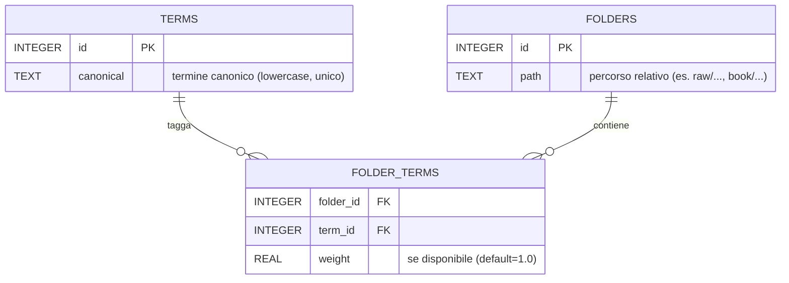

# Streamlit UI — linee guida (dettagliate)

*Allineato alle regole di progetto (vedi *[***coding\_rule.md***](./coding_rule.md)*)*.

---

## Perché queste regole (in breve)

- **Sicurezza**: impedire path traversal/symlink malevoli e scritture non atomiche.
- **Osservabilità**: avere log strutturati e stabili, senza PII, per investigazioni/metriche.
- **Testabilità**: far girare i test senza il runtime Streamlit reale (stub), anche su Windows.
- **Coerenza**: un’unica fonte di verità per stati, query string, e gating funzionali.

---

## Indice

- [Prerequisiti (UI Onboarding)](#prerequisiti-ui-onboarding)
- [Routing e Deep-Linking (fonte unica)](#routing-e-deep-linking-fonte-unica)
- [Query string & slug](#query-string--slug)
  - [Perché ](#perche-stquery_params)[`st.query_params`](#perche-stquery_params)
  - [API consigliata: ](#api-consigliata-uiutils-route_state--uiutils-slug)[`ui.utils.route_state` + `ui.utils.slug`](#api-consigliata-uiutils-route_state--uiutils-slug)
  - [Esempi e anti-pattern](#esempi-e-anti-pattern)
- [Path-safety (lettura/scrittura)](#path-safety-letturascrittura)
  - [Flusso consigliato](#flusso-consigliato)
  - [Esempi pratici](#esempi-pratici)
- [Scan PDF sicuro (DRY)](#scan-pdf-sicuro-dry)
- [Eventi di log strutturati](#eventi-di-log-strutturati)
  - [Tassonomia logging](#tassonomia-logging)
  - [Naming & payload](#naming--payload)
  - [Esempi: pagina Manage](#esempi-pagina-manage)
  - [Test con ](#test-con-caplog)[`caplog`](#test-con-caplog)
- [Gating e SSoT di stato](#gating-e-ssot-di-stato)
- [Compatibilità con gli stub di Streamlit nei test](#compatibilita-con-gli-stub-di-streamlit-nei-test)
- [Checklist “UI page”](#checklist-ui-page)
- [FAQ](#faq)
- [Anti-pattern da evitare](#anti-pattern-da-evitare)

---

## Prerequisiti (UI Onboarding)

- **Streamlit ≥ 1.50.0** – il router nativo (`st.Page`, `st.navigation`) è obbligatorio.
- Deep-linking via `st.query_params` è supportato, ma l’accesso deve passare dagli helper centralizzati (vedi sotto).

---

## Routing e Deep-Linking (fonte unica)

Il routing client-side deve usare le facade in `src/ui/utils/route_state.py`, che mantengono sincronizzati query string e stato interno.

```python
from ui.utils.route_state import get_tab, set_tab, clear_tab, get_slug_from_qp

current_tab = get_tab("home")  # default se ?tab assente
slug = get_slug_from_qp()      # slug opzionale

set_tab("manage")              # aggiorna query params + rerun ordinato
clear_tab()                    # pulisce lo stato
```

Se serve il deep-link “pieno”, invoca `set_tab("home")` appena la pagina viene idratata.

---

## Query string & slug

`st.query_params` resta l'SSoT lato client, ma l'accesso passa da `ui.utils.route_state` (tab + letture slug) e da `ui.utils.slug` (setter/getter ad alto livello). Quando serve garantire la presenza dello slug e rendere coerente l'UI (sidebar, breadcrumbs, titoli), usa i facade come `render_chrome_then_require`.

### Perché `st.query_params`

- Evita parsing manuale degli URL.
- Funziona come dizionario reattivo: gli update triggerano un **rerun** della pagina.
- È coperto dai nostri stub di test.

### API consigliata: `ui.utils.route_state` + `ui.utils.slug`

```python
from ui.utils.route_state import get_tab, set_tab, clear_tab, get_slug_from_qp
from ui.utils.slug import get_active_slug, set_active_slug, clear_active_slug

# Legge stato/query params
tab = get_tab()
slug = get_slug_from_qp() or get_active_slug()

# Aggiorna tab/slug sincronizzando query params e chrome
set_tab("manage")
set_active_slug("acme-srl")
```

Oppure, quando la pagina **richiede** lo slug:

```python
from ui.chrome import render_chrome_then_require

# Se allow_without_slug=False (default), la pagina blocca e guida l'utente
slug = render_chrome_then_require()
```

### Esempi e anti‑pattern

**OK**

```python
slug = get_slug_from_qp() or get_active_slug() or "acme-srl"
set_tab("manage")                  # se serve cambiare tab
```

**EVITARE**

```python
# ❌ Non leggere/scrivere direttamente dalla stringa dell’URL
# ❌ Non conservare lo slug in variabili globali non sincronizzate con query params
```

---

## Path‑safety (lettura/scrittura)

### Flusso consigliato

1. Deriva la radice workspace dal solo `slug` con `ui.utils.workspace.resolve_raw_dir` e ricava il parent.
2. Usa `pipeline.path_utils.ensure_within_and_resolve` prima di leggere/scrivere.
3. Leggi con `pipeline.path_utils.read_text_safe` e scrivi con `ui.utils.core.safe_write_text` (**atomico**).

> Non assumere mai path costruiti con concatenazioni manuali: passa **sempre** dagli helper.

### Esempi pratici

**Caricare/modificare** `semantic/tags_reviewed.yaml`:

```python
from pathlib import Path
import yaml
from ui.utils.workspace import resolve_raw_dir
from pipeline.path_utils import ensure_within_and_resolve, read_text_safe
from ui.utils.core import safe_write_text

def _workspace_root(slug: str) -> Path:
    raw_dir = Path(resolve_raw_dir(slug))  # valida slug + path safety
    return raw_dir.parent

def load_tags_yaml(slug: str) -> str:
    base = _workspace_root(slug)
    yaml_path = ensure_within_and_resolve(base, base / "semantic" / "tags_reviewed.yaml")
    try:
        return read_text_safe(yaml_path.parent, yaml_path, encoding="utf-8")
    except Exception:
        return "version: 2\nkeep_only_listed: true\ntags: []\n"  # default sicuro

def save_tags_yaml(slug: str, text: str) -> None:
    yaml.safe_load(text)  # validazione prima di scrivere
    base = _workspace_root(slug)
    yaml_path = ensure_within_and_resolve(base, base / "semantic" / "tags_reviewed.yaml")
    yaml_path.parent.mkdir(parents=True, exist_ok=True)
    safe_write_text(yaml_path, text, encoding="utf-8", atomic=True)
```

**Perché atomico?** Minimizza corruzioni/condizioni di gara: si scrive su un file temporaneo e poi si fa un rename.

---

### Registry clienti (CLIENTS_DB_*)

- `CLIENTS_DB_PATH` (alias) o la coppia `CLIENTS_DB_DIR`/`CLIENTS_DB_FILE` accettano **solo** percorsi relativi al workspace; niente drive letter o path assoluti.
- Il file deve vivere sotto `clients_db/`; eventuali sottocartelle sono consentite (`clients_db/archive/clients.yaml`).
- Gli helper della UI rifiutano componenti `..`: se serve un percorso alternativo, monta un workspace dedicato e aggiorna `REPO_ROOT_DIR`.

## Scan PDF sicuro (DRY)

Per contare/iterare i PDF **non** usare `Path.rglob`/`os.walk`. Usa sempre l’utility condivisa `iter_safe_pdfs` che applica path-safety forte, ignora i symlink e restituisce path canonicalizzati in ordine deterministico.

```python
from pipeline.path_utils import iter_safe_pdfs

for pdf_path in iter_safe_pdfs(raw_dir):
    ...
```

Se sei in UI, `ui.utils.workspace.iter_pdfs_safe` è un wrapper che inoltra alla stessa utility. In questo modo tutte le sezioni della pipeline (UI, semantic, tool CLI) condividono lo stesso comportamento e i test coprono già i corner case (symlink, traversal, Windows).

---

## Ingestion Vocabolario (YAML -> DB)

```mermaid
flowchart TD
    A[Authoring umano\nsemantic/tags_reviewed.yaml] --> B[Loader YAML\n(validazione + normalizzazione)]
    B --> C[Derivazione percorso DB\n_derive_tags_db_path(...)]
    C --> D[Ensure schema v2\nensure_schema_v2(...)]
    D --> E[Upsert termini canonici\nterms(canonical)]
    E --> F[Upsert cartelle (percorso)\nfolders(path)]
    F --> G[Upsert relazioni\nfolder_terms(folder_id, term_id, weight)]
    G --> H[(SQLite tags.db)]
    H --> I[Runtime UI/Pipeline\n(normalize/enrich/index)]
```



| Campo YAML         | Normalizzazione                | Destinazione DB             | Note                                   |
|--------------------|--------------------------------|-----------------------------|----------------------------------------|
| `tags[].canonical` | lowercase, trim, deduplicate   | `terms.canonical`           | Unico; merge se duplicato              |
| `tags[].aliases[]` | lowercase, trim                | (merge in memoria)          | Nessuna tabella `aliases` attualmente |
| `tags[].folders[]` | percorso relativo normalizzato | `folders.path`              | Path relativi (raw/book/semantic)     |
| folder -> tag link | -                              | `folder_terms(..., weight)` | `weight` facoltativo (default 1.0)    |

```python
# Pseudocode: ingest YAML -> DB (layer storage.tags_store)
def import_tags_yaml_to_db(semantic_dir: Path, yaml_path: Path, logger):
    db_path = _derive_tags_db_path(yaml_path)
    _ensure_tags_schema_v2(str(db_path))

    raw = yaml.safe_load(yaml_path.read_text(encoding="utf-8")) or {}
    terms: dict[str, int] = {}
    folders: dict[str, int] = {}
    links: list[tuple[int, int, float]] = []

    for entry in raw.get("tags", []):
        canonical = norm(entry.get("canonical"))
        if not canonical:
            continue
        tid = upsert_term(db_path, canonical)
        terms[canonical] = tid

        for folder_path in map(norm_path, entry.get("folders") or []):
            if not folder_path:
                continue
            fid = upsert_folder(db_path, folder_path)
            folders[folder_path] = fid
            links.append((fid, tid, 1.0))

    upsert_folder_terms(db_path, links)
    logger.info(
        "semantic.tags_yaml.imported",
        extra={"db": str(db_path), "terms": len(terms), "links": len(links)},
    )
```

> Il loader YAML deve validare lo schema, normalizzare canonical/alias/path e gestire duplicati. L'upsert è idempotente (nessun wipe massivo del DB).

---

## Eventi di log strutturati

### Tassonomia logging

- Vision: `semantic.vision.*` (es. `semantic.vision.create_thread`, `semantic.vision.run_failed`, `semantic.vision.completed`)
- Conversione/Book: `semantic.convert.*`, `semantic.summary.*`, `semantic.readme.*`, `semantic.book.*`
- Indicizzazione: `semantic.index.*`
- Preflight (bypass one-shot): `ui.preflight.once`

### Naming & payload

- Schema: `ui.<pagina>.<sottoarea>.<azione>` (es.: `ui.manage.tags.save`).
- **Niente PII** o contenuto file; payload **minimale** (`slug`, path relativo/basename, messaggio errore redatto).
- Usa `logging.getLogger("ui.<pagina>")` (o il logger strutturato dove previsto) e lascia ai filtri globali la redazione.

### Esempi: pagina Manage

```python
import logging
from pipeline.logging_utils import get_structured_logger
LOGGER = get_structured_logger("ui.manage")

# Apertura editor
LOGGER.info("ui.manage.tags.open", extra={"slug": slug})

# Validazione YAML
try:
    yaml.safe_load(content)
    LOGGER.info("ui.manage.tags.yaml.valid", extra={"slug": slug})
except Exception as exc:
    LOGGER.warning("ui.manage.tags.yaml.invalid", extra={"slug": slug, "error": str(exc)})
    ...

# Salvataggio (ok/errore)
LOGGER.info("ui.manage.tags.save", extra={"slug": slug, "path": str(yaml_path)})
LOGGER.warning("ui.manage.tags.save.error", extra={"slug": slug, "error": str(exc)})
```

### Test con `caplog`

```python
def test_emette_eventi_tags(caplog, monkeypatch):
    import ui.pages.manage as manage

    caplog.set_level("INFO")
    slug = "acme"

    # Monkeypatch writer per evitare I/O reale
    monkeypatch.setattr(manage, "safe_write_text", lambda *a, **k: None)

    # Simula azioni utente (p.es. click su Salva + contenuto valido)
    ...

    # Assert sugli eventi
    assert any("ui.manage.tags.open" in r.message for r in caplog.records)
    assert any("ui.manage.tags.save" in r.message for r in caplog.records)
```

---

## Gating e SSoT di stato

1. Calcola i gate con `ui.gating.compute_gates(os.environ)`; combina la disponibilita runtime dei servizi (`ui.services.*`) con gli override da variabili di ambiente:
    - `DRIVE=0` disabilita i flussi Drive (cartelle, cleanup, download).
    - `VISION=0` disabilita il provisioning Vision (estrazione PDF, tool assistito).
    - `TAGS=0` disabilita il tagging e le pagine Semantica e Preview Docker.
    - Qualsiasi altro valore oppure l'assenza della variabile mantiene il default calcolato dal runtime.
2. Trasforma i gate in navigation ready con `ui.gating.visible_page_specs(gates)` e passa l'elenco filtrato al router:

```python
from ui.gating import compute_gates, visible_page_specs
from ui.utils.stubs import get_streamlit

st = get_streamlit()
gates = compute_gates()
pages = {
    group: [st.Page(spec.path, title=spec.title, url_path=spec.url_path or None)]
    for group, specs in visible_page_specs(gates).items()
}
st.navigation(pages)
```

**Perche**: il router vede solo le pagine abilitate, quindi nessun tab inceppa il flusso quando i servizi sono assenti (localmente o in produzione controllata).
In aggiunta al gate `TAGS`, la pagina *Semantica* viene mostrata solo quando lo slug attivo ha effettivamente PDF validi in `raw/` (`ui.utils.workspace.has_raw_pdfs`). Analogamente la pagina *Preview* viene resa visibile solo se sono presenti PDF validi e lo stato cliente appartiene a `SEMANTIC_READY_STATES`; in caso contrario il router emette `ui.gating.sem_hidden`/`ui.gating.preview_hidden` per telemetria.

### Modalita stub e SSoT semantica

Per le pagine semantiche, oltre ai gate controlliamo lo stato del cliente:

```python
from ui.constants import SEMANTIC_READY_STATES
from ui.clients_store import get_state
from ui.utils.workspace import has_raw_pdfs

state = (get_state(slug) or '').strip().lower()
ready, raw_dir = has_raw_pdfs(slug)
if state not in SEMANTIC_READY_STATES or not ready:
    st.info("La semantica sara disponibile quando lo stato raggiunge 'arricchito' e raw/ contiene PDF.")
    st.caption(f"Stato: {state or 'n/d'} - RAW: {raw_dir or 'n/d'}")
    st.stop()
```

**Nota**: il test di contratto (`pytest -m "contract"`) fotografa le pagine visibili per combinazioni di gate e fallisce se una PR introduce regressioni.

### Env preview stub e logging

Il percorso "Preview Docker" supporta una modalita stub pensata per CI ed e2e:

- `PREVIEW_MODE=stub` forza l'uso della pipeline fake senza container reali.
- `PREVIEW_LOG_DIR=/percorso/custom` definisce la cartella dove scrivere i log stub (default `logs/preview` dentro al repo).
- Ogni path viene normalizzato con `ensure_within_and_resolve` e scritto in modo atomico tramite `safe_write_text`.
- Eventi strutturati emessi: `ui.preview.stub_started`, `ui.preview.stub_stopped`, `ui.preview.start_failed`, `ui.preview.stop_failed`.

Quando abiliti lo stub ricorda di puntare `CLIENTS_DB_PATH` e altre risorse persistenti a directory isolate (`tmp_path` nelle fixture), cosi gli end-to-end non toccano workspace reali.

## Compatibilità con gli stub di Streamlit nei test

I test girano con uno **stub** di Streamlit (assenza del runtime reale). Per evitare rotture:

- Avvolgi le chiamate facoltative con `getattr(st, "api", None)` e verifica che siano **callable**.
- Fallback per layout:
- Se devi azzerare lo stato condiviso tra test, chiama `ui.utils.stubs.reset_streamlit_stub()` nelle fixture (`autouse=True` consigliato).

```python
_markdown = getattr(st, "markdown", None)
if callable(_markdown):
    _markdown("")

# Columns resilienti
make_cols = getattr(st, "columns", None)
if callable(make_cols):
    try:
        c1, c2, c3 = make_cols([1, 1, 1])
    except Exception:
        cols = list(make_cols(3)) if callable(make_cols) else []
        while len(cols) < 3:
            cols.append(cols[-1] if cols else st)
        c1, c2, c3 = cols[:3]
else:
    c1 = c2 = c3 = st

# NO with c1: ... se lo stub non supporta il context manager
# Preferisci: c1.button(...), c2.button(...)
```

- Evita pattern che forzano `with col:` sugli stub: alcuni colonnati mock non implementano il context manager.

---

### Tema ufficiale + Enhancement CSS (progressive enhancement)

Il **tema ufficiale** vive in `.streamlit/config.toml` ed è la fonte unica del brand (palette, font, base light/dark). Questo garantisce coerenza visiva anche qualora l'iniezione HTML venga bloccata o filtrata. Gli **enhancement CSS** (iniettati una sola volta via `st.html`) servono solo per micro-affinamenti non esposti dalle opzioni native: radius **gentili**, micro-spaziature, focus ring accessibile, piccoli fix di rendering. In pratica: colori e tipografia nel `config.toml`; dettagli tattili e a11y nell'enhancement. Manteniamo gli enhancement **idempotenti**, compatibili con light/dark (evitare override cromatici aggressivi) e confinati in un `<style id="nexty-theme-enhancements">` per tracciabilità e rollback. Criterio di accettazione: con gli enhancement disattivati il brand resta intatto; riattivandoli si percepisce solo un miglioramento della qualità interattiva senza variazioni di palette o regressioni di leggibilità.

- Vedi `.streamlit/config.toml` per la configurazione completa: per passare a base scura mantenendo la palette esistente è sufficiente impostare `base = "dark"` e riavviare la UI.

---

## Checklist “UI page”

Prima di aprire una PR:

**Stato & routing**

- Usa `st.Page`/`st.navigation` e niente router legacy.
- Se la pagina richiede slug: `render_chrome_then_require()` / `require_active_slug()`.
- Navigazione interna con `st.page_link` / `st.switch_page` (no `<a href="/...">`).

**File I/O**

- Path-safety con `ensure_within_and_resolve`, I/O atomico con `safe_write_text`.
- Niente `Path.rglob` sui workspace: usa `iter_pdfs_safe`/`count_pdfs_safe`.

**Osservabilità**

- Logger `ui.<pagina>` e eventi minimali senza PII (vedi esempi “Manage”).

**UX & stub‑compat**

- Feedback con `status_guard` o `st.status` (no sleep/progress finti).
 - Evita `with col:` se lo stub non lo supporta; usa gli helper centralizzati:
   `from ui.utils.ui_controls import columns3, column_button, button`.

---

### Registry dei path UI (SSoT)
Per evitare divergenze tra `onboarding_ui.py` (router) e i link nelle pagine, i path delle pagine sono definiti una sola volta in `ui.pages.registry.PagePaths`.
Usa:
- `from ui.pages.registry import PagePaths` per link diretti (`st.page_link(PagePaths.NEW_CLIENT, ...)`).
- `from ui.pages.registry import build_pages` nell’entrypoint per generare il `pages` dict per `st.navigation(...)`.

La navigazione programmativa deve passare da `ui.utils.compat.nav_to(PagePaths.X)`, che gestisce `st.switch_page(...)` e il fallback via `?tab=<url_path>`.

---


## FAQ

**D: Posso usare **`Path.write_text`** per scrivere file?**\
R: No. Usa **sempre** `safe_write_text(..., atomic=True)` per garantire atomicità e logging coerente.

**D: Perché non posso usare **`Path.rglob`**?**\
R: Non è path‑safe e può seguire symlink non desiderati. Usa `iter_pdfs_safe`/`count_pdfs_safe`.

**D: Dove metto i log?**\
R: Logger di pagina (es. `logging.getLogger('ui.manage')`) con eventi `ui.manage.*`. I filtri globali si occupano di redazione.

**D: Come gestisco la validazione YAML?**\
R: Valida **prima** di scrivere (`yaml.safe_load`) e, in caso di errore, emetti `ui.<pagina>.<area>.yaml.invalid` senza persist.

---

## Anti‑pattern da evitare

- ❌ `Path(...).rglob('*.pdf')`, `os.walk(...)` sul workspace → **usa** `iter_pdfs_safe` / `count_pdfs_safe`.
- ❌ Scritture non atomiche (`open(..., 'w')`) → **usa** `safe_write_text(...)`.
- ❌ Path costruiti a mano senza guardrail → **usa** `ensure_within_and_resolve(...)`.
- ❌ Dati sensibili nei log (contenuti, token, path assoluti di sistema).
- ❌ Dipendenze dirette da API Streamlit non stubbate senza `getattr(...)`/fallback.

---

### Note finali

- Questo documento è SSoT per la UI Streamlit e si affianca a [coding\_rule.md](./coding_rule.md).
- Gli esempi sono tratti da implementazioni reali nelle pagine **Manage** e **Semantics** e risultano eseguibili nel progetto.
