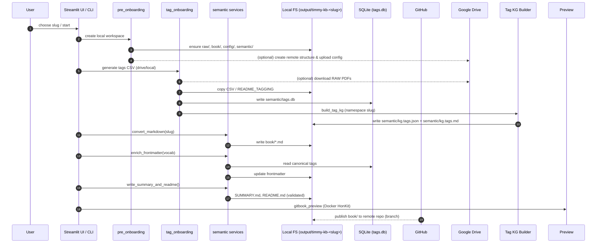

# Architecture Overview (v1.0 Beta)


This page contains two Mermaid diagrams that illustrate Timmy KB at a high level.


## Agency-first foundation

- ProtoTimmy governs the foundation pipeline that produces semantically enriched markdown and validates the knowledge graph; only after that artifact pair is ready does Timmy assume the dialogic agency with Domain Gatekeepers and micro-agents.

- Domain Gatekeepers validate policy and can veto with HiTL triggers; the Control Plane / Engineering Gatekeeper applies those gates while Prompt Chain/instructions define WHAT (governance) versus HOW (execution).

- Codex and the pipeline helpers (`pipeline.*`, CLI flows, semantic services) execute the foundation tasks under Work Order Envelope (OK / NEED_INPUT / CONTRACT_ERROR) without orchestration authority; these tooling references are therefore HOW, not decision makers.


## Architecture scope

- WHAT: governance (ProtoTimmy/Timmy, Domain Gatekeepers, Control Plane/OCP, Prompt Chain) documented in `instructions/*`.

- HOW: execution surface (`pipeline.*`, CLI/UI orchestrators, semantic services, GitHub/Drive helpers) that deliver markdown + KG.

- Interpret the diagrams below as HOW flows serving the foundation; agency statements above specify when Timmy takes over.


## Components


```mermaid

flowchart LR

    subgraph Client

      UI[Streamlit UI (src/ui/*)]

      CLI[CLI Orchestrators]

    end


    subgraph Agency

      PROTO[ProtoTimmy (foundation governance)]

      TIMMY[Timmy (agency after foundation complete)]

      GATE[Domain Gatekeepers (validation)]

      OCP[Control Plane / Engineering Gatekeeper (gate application)]

      MICRO[Codex & micro-agents (Work Order Envelope execution)]

    end


    PROTO -->|defines foundation tasks| GATE

    TIMMY -->|assumes agency| GATE

    GATE -->|hiTL| OCP

    OCP -->|dispatch| MICRO


    subgraph Orchestrators

      PRE[timmy_kb.cli.pre_onboarding]

      TAG[timmy_kb.cli.tag_onboarding]

      KG[kg_build.py (Tag KG Builder)]

      SEMCLI[timmy_kb.cli.semantic_onboarding (wrapper for semantic.* services)]

      PREVIEW[gitbook_preview.py]

VISIONCLI[src/tools/gen_vision_yaml.py]

    end


    subgraph Foundation tools (HOW)

      PCTX[pipeline.context]

      PPATH[pipeline.path_utils]

      PCONT[pipeline.content_utils]

      PLOG[pipeline.logging_utils]

      PGIT[pipeline.github_utils]

      PDRIVE[pipeline.drive_utils]

    end


    subgraph Semantic

      SEMANTIC[semantic.convert/frontmatter/embedding/mapping + semantic.nlp_runner]

      SVISION[semantic.vision_provision + UI services]

    end


    subgraph Storage

      DB[(SQLite: semantic/tags.db)]

      FILES[[output/timmy-kb-<slug>]]

    end


    subgraph Adapters

      HONKIT[Preview (HonKit/Docker)]

      GITHUB[GitHub (push)]

      DRIVE[Google Drive]

    end


    subgraph AI Services

      OPENAI[(OpenAI Chat API)]

    end


    UI -->|actions| PRE

    UI -->|actions| TAG

    UI -->|actions| KG

    UI -->|actions| SEMCLI

    UI -->|preview| HONKIT


    CLI --> PRE

    CLI --> TAG

    CLI --> KG

    CLI --> SEMCLI

    CLI --> FULL

    CLI --> VISIONCLI


    PRE --> PCTX

    PRE --> PDRIVE

    PRE --> FILES


    TAG --> KG

    KG --> SEMANTIC

    TAG --> FILES

    TAG --> DB


    SEMCLI --> SEMANTIC

    SEMANTIC --> PCONT

    VISIONCLI --> SVISION

    SEMANTIC --> FILES

    SEMANTIC --> DB


    FULL --> PGIT

    PGIT --> GITHUB


    SVISION --> OPENAI


Vision provisioning now relies on the single `ai.vision_config` resolver and the `_with_config` operators exposed by `semantic.vision_provision` (CLI entrypoint `src/tools/gen_vision_yaml.py`). These components are part of the foundation execution (HOW); the governance to decide when they run is defined in `instructions/*` via the Prompt Chain. The architecture assumes dedicated hardware, controlled environments, automated processes, and loud failures to keep each step auditable and deterministic.


- **Tag KG Builder:** `kg_build.py` (CLI) and the UI Knowledge Graph panel for tags invoke `build_kg_for_workspace`, read `semantic/tags_raw.json`, and write `semantic/kg.tags.json` / `semantic/kg.tags.md` before `semantic_onboarding` regenerates the README files.


    PDRIVE --> DRIVE

```


## Component overview

- **Agency layer (WHAT):** ProtoTimmy governs the foundation pipeline, Timmy assumes agency once the foundation is complete (semantically enriched markdown + knowledge graph validated), Domain Gatekeepers validate policies, and the Control Plane / OCP applies HiTL while Codex/micro-agents execute under Work Order Envelope.

- **Foundation tools & execution surfaces (HOW):** pipeline.* helpers (context, workspace_layout, path_utils, logging_utils, drive_utils), CLI orchestrators (pre_onboarding, tag_onboarding, semantic_onboarding, gitbook_preview, kg_build.py, src/tools/gen_vision_yaml.py), Streamlit UI (onboarding_ui.py, src/ui/*), and semantic services (semantic.*) produce the artifacts but do not make orchestration decisions.

- **Workspace/storage:** output/timmy-kb-<slug>/raw/book/semantic/config/logs, semantic/tags.db, and WorkspaceLayout form the artifact SSoT.


## End-to-end Sequence




> Foundation complete: once markdown enriched (book/*.md, README.md, SUMMARY.md) and the knowledge graph artifacts (semantic/tags.db, semantic/kg.tags.*) pass validation, Timmy assumes agency; until then ProtoTimmy and the control plane manage the pipeline execution (HOW), and the Prompt Chain in instructions/* governs the Domain Gatekeepers, Control Plane/OCP, and micro-agent execution.


## Workspace SSoT & Path Flow


The onboarding pipeline (CLI, UI, semantic stages) now relies on a unified WorkspaceLayout as the Single Source of Truth (SSoT) for all workspace-related filesystem paths. Paths such as raw/, semantic/, book/, logs/, config/, and mapping/ are no longer constructed manually. They are instead resolved through WorkspaceLayout, which enforces path-safety, consistency across orchestrators, and eliminates drift between CLI and UI components.


`
                     +--------------------------+

                     |       ClientContext      |

                     |  (slug, settings, env)   |

                     +-----------+--------------+

                                   |

                                   v

                     +--------------------------+

                     |      WorkspaceLayout     |

                     |  Derived path SSoT       |

                     |  raw/ semantic/ book/    |

                     |  logs/ config/ mapping   |

                     +-----------+--------------+

                                 |

       +-------------------------+-------------------------+

       v                         v                         v

 +-------------------+  +----------------------+  +-----------------------+

 | CLI Orchestrators |  | Streamlit UI /      |  | Semantic Pipeline     |

 | pre, tag, semantic|  | Services            |  | convert, enrich,      |

 | kg_build, full    |  | new_client, tagging, |  | readme, indexing,     |

 |                   |  | vision              |  | mapping               |

 +--------+----------+  +--------+-------------+  +---------+-------------+

          |                     |                         |

          v                     v                         v

 Uses always:          Uses always:                 Uses always:

 WorkspaceLayout.*     WorkspaceLayout.*            WorkspaceLayout.*

 log_file, raw_dir,     raw_dir,                     semantic_dir,

 base_dir,              semantic_dir                book_dir,

                        mapping_path,                tags_db

`


Manual construction of workspace paths (e.g. base_dir/'raw', base_dir/'semantic') is deprecated. All components must rely on WorkspaceLayout or ClientContext helpers to ensure filesystem consistency and security guarantees. Refer to the Coding Rules and Developer Guide for the enforced workflow and examples.


## Operational notes

1. YAML is used for the initial bootstrap, but at runtime SQLite (`semantic/tags.db`) is the source of truth for semantic metadata.
2. The convert/enrich/summary phases share `_run_build_workflow` and log `semantic.book.frontmatter` with the number of enriched files, keeping UI and CLI aligned.
3. Conversion fails if only README/SUMMARY artifacts remain after a run (no `.md` content generated); ensure `raw/` contains valid PDFs before triggering semantic processors.
4. Vision mapping generation uses `semantic/vision_provision.py` (UI integration via `src/ui/services/vision_provision.py`), writes the textual snapshot `semantic/vision_statement.txt` beside the YAML, and always invokes the model configured in `config/config.yaml` via `get_vision_model()`.
5. Additional CLI entrypoints (`src/ingest.py`, `src/timmy_kb/cli/retriever.py`, `src/timmy_kb/cli/semantic_headless.py`, `src/kb_db.py`) orchestrate standalone steps that reuse pipeline and semantic helpers.
6. Tagging/UI shared state is stored in `src/storage/tags_store.py` (atomic JSON) and `clients_db/ui_state.json`; both remain within `output/timmy-kb-<slug>` as the local SSoT.
7. SQLite indexing excludes `README.md` and `SUMMARY.md` and drops empty embeddings per file (log events such as `semantic.index.skip_empty_file` and `semantic.index.embedding_pruned`).
8. Partial indexing for mismatched `contents` and `embeddings` processes the minimal common subset and emits `semantic.index.mismatched_embeddings`, `semantic.index.embedding_pruned`, and a single `semantic.index.skips` event.
9. Empty-run telemetry flows through the `phase_scope` branch with `artifact_count=0` and closes via `semantic.index.done`.
